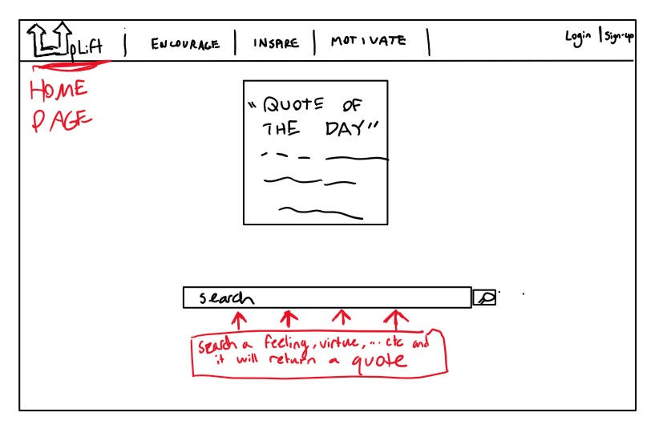
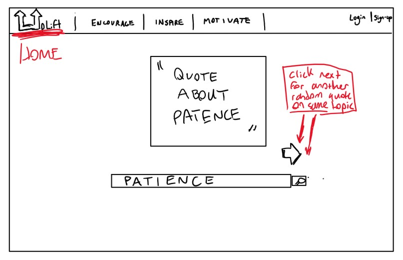
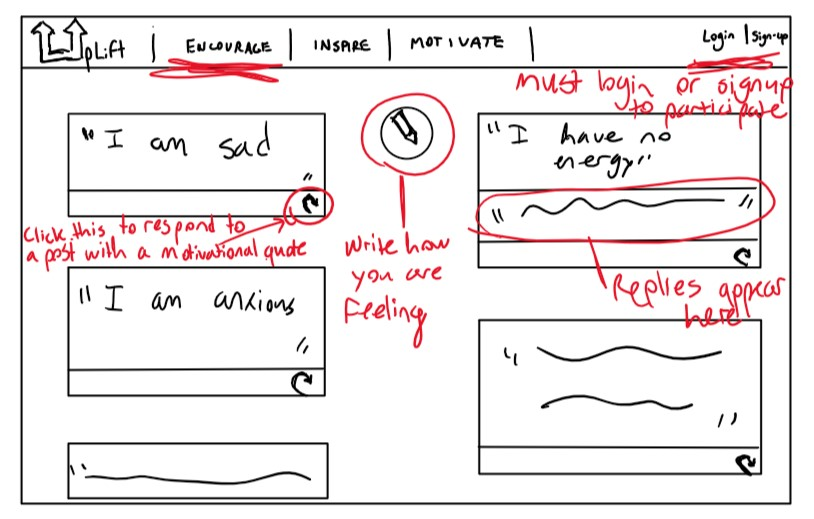
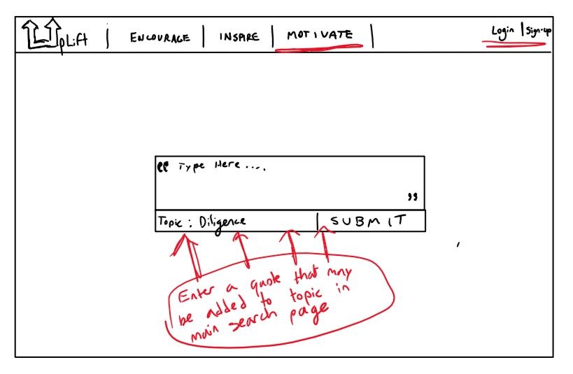

# startup
I want to create a website that is designed to uplift, encourage, and inspire everyone that uses it so that they feel motivated and ready to go about their day while also helping the other site users to feel the same way. The main page would feature a quote of the day as well as a search bar or at least a selection of different feelings or virtues the user would like a quote about (ie: hope, motivation, stress, patience). There will be another tab where, once a user creates a login, they can post how they are feeling and other users are able to respond with either a quote of their own or an inspirational quote that fits the feelings. Another tab will allow users to submit an inspiring story that happened in their life, an family member or friends life, or an ancestors life. If I have enough time and skill, I will make another tab that allows users to submit inspirational quotes they have found, or even their own quotes for consideration to be added to the main database of quotes. If possible I will also consider adding a scripture search option on the main tab that could be toggled on and off.

